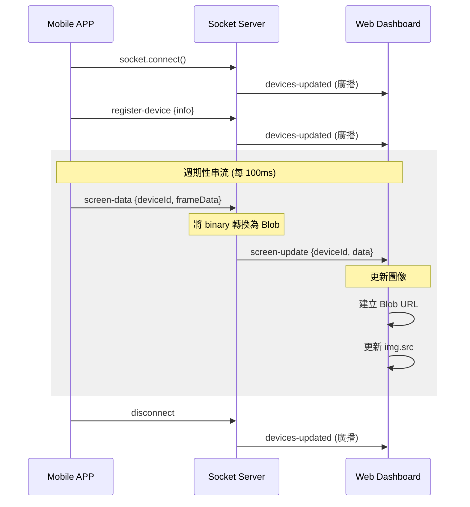

# Screen Sharing Demo (Backend)

## 流程圖

```mermaid
sequenceDiagram
    participant Device as Mobile APP
    participant Server as Socket Server
    participant Dashboard as Web Dashboard

    %% 設備註冊
    Device->>Server: socket.connect()
    Server->>Dashboard: devices-updated (廣播)
    Device->>Server: register-device {info}
    Server->>Dashboard: devices-updated (廣播)

    %% 畫面串流
    rect rgb(240, 240, 240)
        Note over Device,Dashboard: 週期性串流 (每 100ms)
        Device->>Server: screen-data {deviceId, frameData}
        Note over Server: 將 binary 轉換為 Blob
        Server->>Dashboard: screen-update {deviceId, data}
        Note over Dashboard: 更新圖像
        Dashboard->>Dashboard: 建立 Blob URL
        Dashboard->>Dashboard: 更新 img.src
    end

    %% 斷開連接
    Device->>Server: disconnect
    Server->>Dashboard: devices-updated (廣播)
```
