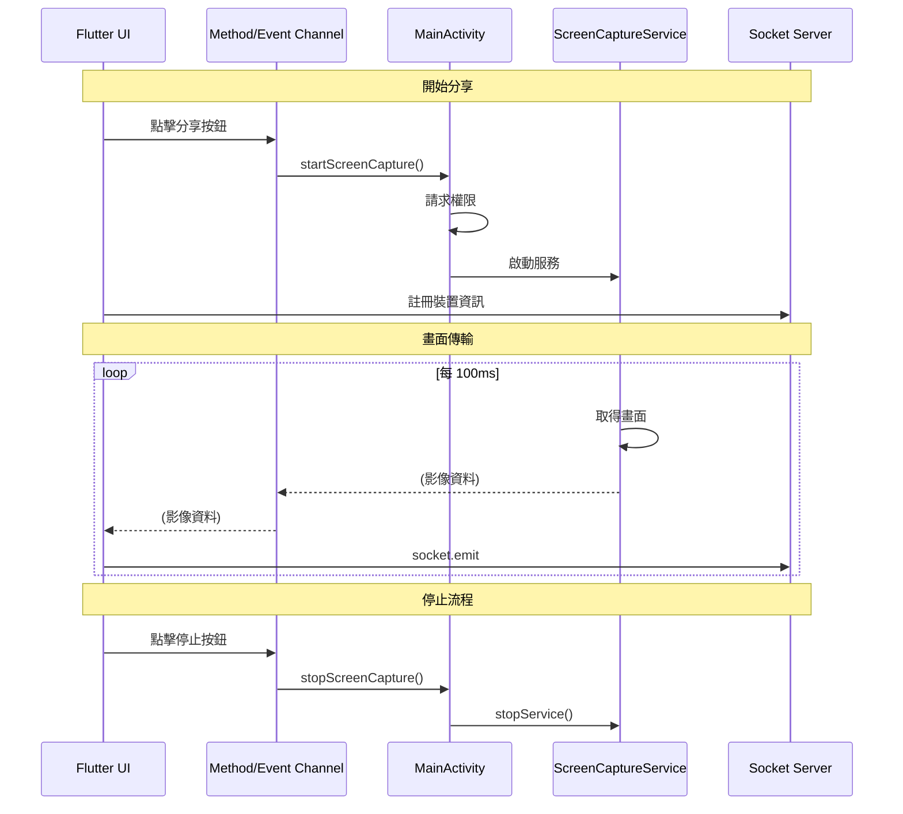

# Screen Sharing Demo (Flutter)

## 流程圖

```mermaid
sequenceDiagram
    participant UI as Flutter UI
    participant Channel as Method/Event Channel
    participant Activity as MainActivity
    participant Service as ScreenCaptureService
    participant Server as Socket Server

    %% 啟動螢幕分享
    Note over UI,Server: 開始分享
    UI->>Channel: 點擊分享按鈕
    Channel->>Activity: startScreenCapture()
    Activity->>Activity: 請求權限
    Activity->>Service: 啟動服務
    UI->>Server: 註冊裝置資訊

    %% 資料串流
    Note over UI,Server: 畫面傳輸
    loop 每 100ms
        Service->>Service: 取得畫面
        Service-->>Channel: (影像資料)
        Channel-->>UI: (影像資料)
        UI->>Server: socket.emit
    end

    %% 停止分享
    Note over UI,Server: 停止流程
    UI->>Channel: 點擊停止按鈕
    Channel->>Activity: stopScreenCapture()
    Activity->>Service: stopService()
```
