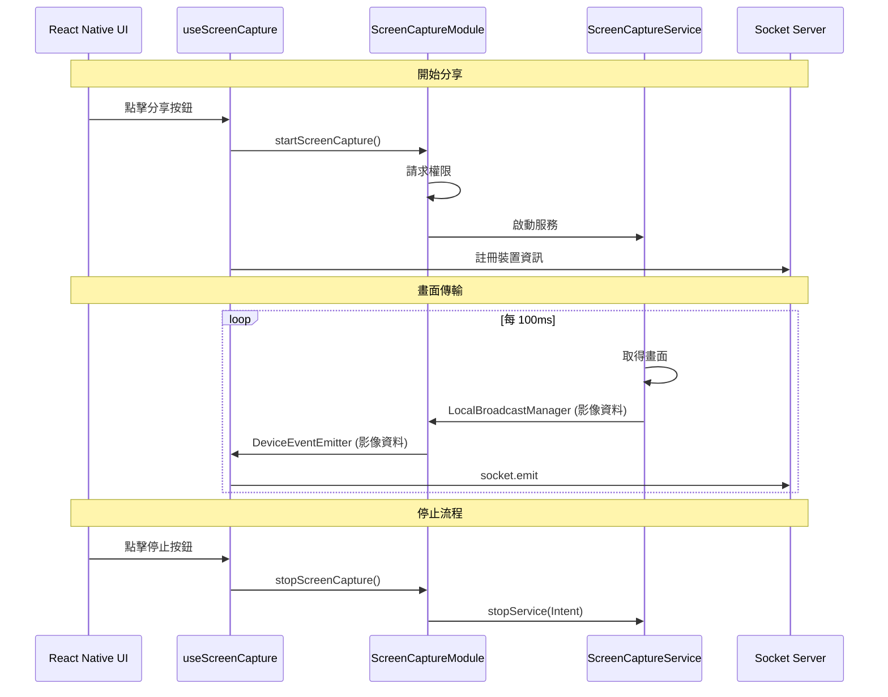

# Screen Sharing Demo (React Native Expo)

## 流程圖

```mermaid
sequenceDiagram
   participant UI as React Native UI
   participant Hook as useScreenCapture
   participant Module as ScreenCaptureModule
   participant Service as ScreenCaptureService
   participant Server as Socket Server

   %% 啟動螢幕分享
   note over UI,Server: 開始分享
   UI->>Hook: 點擊分享按鈕
   Hook->>Module: startScreenCapture()
   Module->>Module: 請求權限
   Module->>Service: 啟動服務
   Hook->>Server: 註冊裝置資訊
   
   %% 資料串流
   note over UI,Server: 畫面傳輸
   loop 每 100ms
      Service->>Service: 取得畫面
      Service->>Module: LocalBroadcastManager (影像資料)
      Module->>Hook: DeviceEventEmitter (影像資料)
      Hook->>Server: socket.emit
   end
   
   %% 停止分享
   note over UI,Server: 停止流程
   UI->>Hook: 點擊停止按鈕
   Hook->>Module: stopScreenCapture()
   Module->>Service: stopService(Intent)
```
